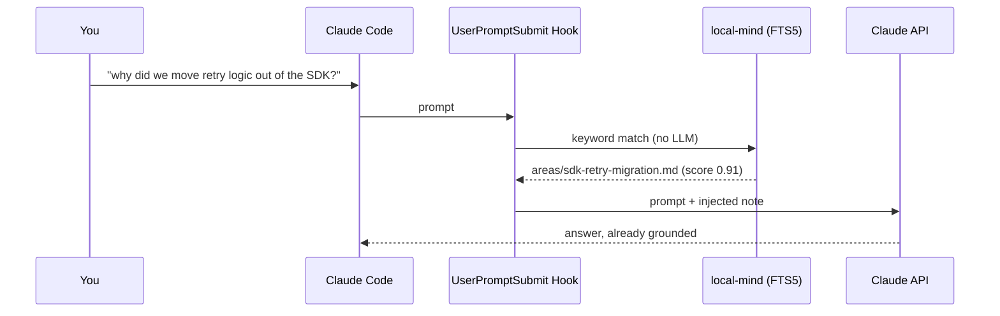

# local-mind

**Deterministic retrieval bridge between a plain-text "second brain" and Claude Code.**

Claude Code has no durable recall of your past notes, decisions, and context unless you paste them in by hand, let it burn a round-trip grepping for them, or stuff them into `CLAUDE.md`/`MEMORY.md` — which then get re-read *in full* every session. **local-mind** runs a keyword match over your Obsidian vault and Claude Code memory dirs **before the prompt reaches the model**, and injects only the relevant note(s) as context.

Retrieval is LLM-free: **zero token cost when nothing matches, no round-trip cost when something does.**

---

## How It Works

When you submit a prompt, Claude Code fires a `UserPromptSubmit` hook *before* the prompt is sent to the model. local-mind intercepts it, runs a deterministic FTS5 match against a local index of your notes, and injects the best matches into the context of that same request.



### Why not just use `MEMORY.md`?

`MEMORY.md` and `CLAUDE.md` are loaded **whole, every session**, relevant or not — they don't scale to a vault. local-mind surfaces only the slice that matches the prompt at hand, on demand, so the always-loaded index can stay small.

### Two-tier confidence banding

Blindly injecting a whole matched file is the naive design's weakness: one keyword collision dumps the wrong note into context. Instead, each match gets a **term-coverage confidence** (0..1 — how many query terms hit a note's *structural* fields: name / aliases / description / headings, vs. only its body) and is injected by band, under a hard token budget:

| Band | Confidence | Action |
|------|-----------|--------|
| **very-high** | ≥ `very_high` | Inject the note body (budget-capped) |
| **high** | ≥ `high` | Inject `description` + path only — Claude reads the file itself if it wants more |
| **low** | below `high` | Inject nothing; list candidates in the trace |

A note with `private: true` in its frontmatter is indexed for local `grep` but **never** auto-injected.

---

## Before & After

```
# Without local-mind
$ claude "why did we move the retry logic out of the client SDK last month"
Claude: I don't have context on that decision. Can you share the relevant notes or PRs?

# With local-mind (hook injects the note; trace on stderr)
$ claude "why did we move the retry logic out of the client SDK last month"
[local-mind: injected areas/sdk-retry-migration.md (age 3wk), band body, score 0.91]
Claude: You moved it because the SDK's retry masked partial failures from callers…
```

Every injection prints an inline trace to stderr with the note's path, age, band, and score — so a wrong or unwanted match is visible the moment it happens.

---

## Install

**macOS / Linux / Git-Bash:**

```bash
curl -fsSL https://raw.githubusercontent.com/AgusRdz/local-mind/main/install.sh | sh
```

Specific version or custom directory:

```bash
curl -fsSL https://raw.githubusercontent.com/AgusRdz/local-mind/main/install.sh | LOCAL_MIND_VERSION=v0.1.0 sh
curl -fsSL https://raw.githubusercontent.com/AgusRdz/local-mind/main/install.sh | LOCAL_MIND_INSTALL_DIR=/usr/local/bin sh
```

The installer places the binary in `~/.local/bin` by default and adds it to `~/.zshrc`/`~/.bashrc` if needed. Reload your shell afterward.

**Windows (PowerShell):**

```powershell
irm https://raw.githubusercontent.com/AgusRdz/local-mind/main/install.ps1 | iex
```

Places the binary in `%LOCALAPPDATA%\Programs\local-mind` and adds it to your user PATH. Restart your terminal after installing.

**From source** (requires Docker — build runs in a container, no host Go toolchain):

```bash
git clone https://github.com/AgusRdz/local-mind && cd local-mind
make install            # build in Docker + install to your bin
```

**With Go** (`modernc.org/sqlite` is pure Go — no cgo):

```bash
go install github.com/AgusRdz/local-mind@latest
```

Then wire it up:

```bash
local-mind init         # register the UserPromptSubmit hook
local-mind rebuild      # build the index from your notes
```

---

## Verification

Release binaries carry [GitHub Artifact Attestations](https://docs.github.com/en/actions/security-guides/using-artifact-attestations-to-establish-provenance-for-builds) — cryptographic proof a binary was built from this repo at a specific commit:

```bash
gh attestation verify local-mind-windows-amd64.exe --repo AgusRdz/local-mind
```

If signing is enabled, `checksums.txt` is also signed with an Ed25519 key; the install scripts verify it automatically when `public_key.pem` sits alongside them. See [docs/RELEASING.md](docs/RELEASING.md) for signing setup.

---

## Quick Start

```bash
local-mind init            # register the hook in ~/.claude/settings.json
local-mind rebuild         # index every .md under your configured sources
local-mind grep "retry"    # manual query — same matching as the hook
# ...then just use Claude Code. Relevant notes appear automatically.
```

---

## Claude Code Integration

local-mind registers a single `UserPromptSubmit` hook. After that, every prompt is matched against your index and grounded automatically.

```bash
local-mind init            # install the hook
local-mind init --status   # check whether it's installed
local-mind uninstall       # remove the hook
```

The hook injects context on stdout (only what fits the budget) and prints its trace to stderr. It never blocks or fails a prompt: on any error it injects nothing and exits cleanly.

---

## Configuration

`~/.local-mind/config.yml` is scaffolded on first run and auto-detects your vault + memory dirs:

```yaml
sources:                       # note roots to index (absolute paths)
  - /home/you/.claude/memory
  - /home/you/dev/second-brain
ignore:                        # glob patterns (matched against the path)
  - "**/templates/**"
bands:
  very_high: 0.60              # >= this -> inject body
  high: 0.35                   # >= this -> inject description
budget:
  max_notes: 3                 # cap notes injected per prompt
  max_tokens: 1200             # cap total injected tokens (~4 chars/token)
```

Tune the bands from what `local-mind stats` reports. Index lives at `~/.local-mind/index.db`; the trace log at `~/.local-mind/trace.log`. Both are disposable — rebuild from files anytime.

---

## Commands

| Command | Description |
|---------|-------------|
| `local-mind rebuild [--incremental]` | Build the FTS5 index. `--incremental` re-indexes only changed files. |
| `local-mind grep "<query>"` | Manual query — identical matching/banding to the hook. |
| `local-mind init [--status]` | Install the `UserPromptSubmit` hook, or report its status. |
| `local-mind uninstall` | Remove the hook from `settings.json`. |
| `local-mind doctor` | Health check — hook registered, sources exist, index built, config valid. Exits non-zero on failure. |
| `local-mind stats [--since 7d]` | Injection/miss summary, effective miss rate, confidence percentiles + histogram. |
| `local-mind bad` | Flag the last injection as unhelpful — a hard feedback signal folded into the miss rate. |
| `local-mind config <cmd>` | `show` · `path` · `edit` · `set <key> <val>` · `add-source <path>` · `add-ignore <glob>`. |
| `local-mind hook` | Hook entrypoint (reads stdin JSON) — invoked by Claude Code, not by hand. |
| `local-mind version` | Print the version. |

`config set` keys: `very_high`, `high` (band thresholds), `max_notes`, `max_tokens` (injection budget). Durations for `stats --since` accept `30m`, `24h`, `7d`, `2w`.

---

## Maintenance

```bash
local-mind rebuild --incremental   # refresh the index after editing notes
local-mind stats                   # see injection counts and estimated miss rate
local-mind uninstall               # remove the hook (index/config are left in place)
rm -rf ~/.local-mind               # nuke index + config + trace entirely
```

---

## Development

All Go tooling runs **inside Docker** — the host needs no Go runtime:

```bash
make build       # build in a container
make test        # go test ./...
make coverage    # tests + coverage report
make cross       # cross-build linux/darwin/windows × amd64/arm64
make install     # build for your platform + install to your bin
```

Release helpers (`make release[-patch|-minor|-major]`) require [git-cliff](https://git-cliff.org). See [docs/RELEASING.md](docs/RELEASING.md) for the full release + signing flow, and [docs/PLAN.md](docs/PLAN.md) / [ROADMAP.md](ROADMAP.md) for design and status.

## License

MIT
